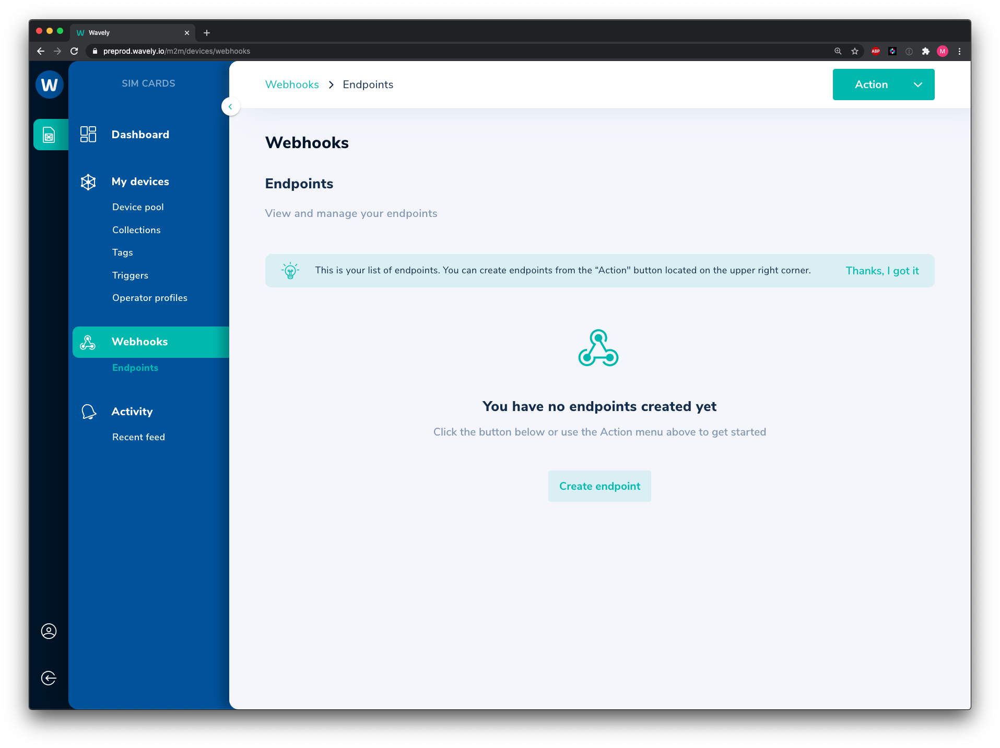

# About webhooks

Webhooks are user-defined API calls over HTTP or HTTPS.  
It allows you to subscribe to certain interesting events and be notified of their occurrences as they happen.

To allow for secure data transmission, please make sure you have a valid TLS certificate in your end, and create the subscription using HTTPS.  
Our back-ends will exchange the certificate and securely transmit the data. 

## Creating a webhook

Access the Wavely Platform, navigate to the *WEBHOOKS* menu item in the left hand navigation bar, and use the *Action Button* in the top right hand corner. 

